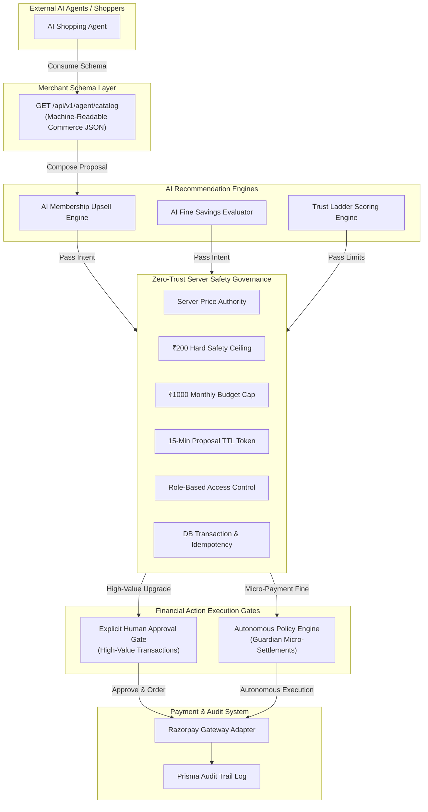

# Community Library — AI Commerce & Safety Governance Platform

> **Razorpay AI Buildathon — Track 01 (AI Growth & Agentic Commerce)**

An AI-native commerce and safety-governance platform for a community library, built to demonstrate how AI agents can discover products, influence purchasing decisions, and execute bounded financial actions safely.

---

## 1. Project Narrative & Domain

While built within the domain of a community library, this repository is **not just a traditional library management system**. It is an engineering implementation of **Agentic Commerce and Zero-Trust Financial Governance**.

It demonstrates how merchants can expose machine-readable commerce schemas to autonomous AI shopping agents, leverage LLMs for personalized membership upsells, and enable zero-click guardian micro-settlements—all while guaranteeing that **the AI never holds unrestricted authority over money**.

---

## 2. Why This Project?

Traditional e-commerce platforms are architected around human UI interactions:

$$\text{Human Member} \longrightarrow \text{Web UI / Buttons} \longrightarrow \text{Financial Checkout}$$

In an agentic economy, commerce workflows evolve into machine-to-machine interactions:

$$\text{AI Agent} \longrightarrow \text{Machine-Readable Schema} \longrightarrow \text{Proposal / Intent} \longrightarrow \text{Server Governance} \longrightarrow \text{Financial Action}$$

### The Core Engineering Challenge
> **How do you give AI agents financial agency without giving the AI unrestricted authority over money?**

This platform solves that challenge by implementing a **Zero-Trust AI Financial Layer**: the AI can compose proposals, evaluate usage habits, and request autonomous execution, but every financial mutation is bounded by server-authoritative price locks, hard system ceilings, 15-minute TTL gates, and explicit human consent.

---

## 3. Core Features

| # | Feature | What It Does | Primary API / UI Entrypoint | Key Safety Assurance |
| :-: | :--- | :--- | :--- | :--- |
| **1** | **Agent-Readable Merchant Catalog** | Exposes structured JSON schemas for external AI agents | `GET /api/v1/agent/catalog`<br/>UI: `/admin/agent-catalog` | Machine-readable purchasing metadata without HTML scraping |
| **2** | **AI Upsell / Fine Savings** | Evaluates member habits to recommend cost-saving membership upgrades | `POST /api/v1/agent/upsell/evaluate`<br/>UI: `/payment` | LLM generates rationale; server enforces authoritative DB pricing |
| **3** | **Guardian Autonomous Auto-Pay** | Executes zero-click micro-settlements for overdue fine charges | `POST /api/v1/admin/autopay-demo/simulate`<br/>UI: `/admin/autopay-demo` | Dynamic trust ladder, ₹200 hard ceiling, ₹1000 monthly cap |
| **4** | **AI Safety Governance** | Zero-trust backend enforcement wrapper for all AI commerce | System-wide Backend Layer | Server price authority, TTL locks, idempotency, atomic rollbacks |
| **5** | **Bounded Agentic Checkout** | 2-step Proposal $\rightarrow$ Approval pipeline for external shopping agents | `POST /api/v1/agent/checkout/proposal`<br/>`POST /api/v1/agent/checkout/approve` | 15-minute price lock token + mandatory human approval gate |

### Feature Details

#### 1. Agent-Readable Merchant Catalog
- Exposes structured JSON (`GET /api/v1/agent/catalog`) describing membership duration tiers (1, 3, 6, 12 months), pricing, eligibility requirements, stock signals, and explicit `purchase_action` payload templates.
- Includes a live frontend JSON Inspector (`AgentCatalogPage.tsx`) allowing judges to toggle between visual cards and raw machine-readable JSON payloads.

#### 2. AI Upsell / Fine Savings
- Evaluates member borrowing history using LangChain/LangGraph LLMs to generate rationale for upgrades.
- **Server Price Authority**: The LLM recommends the upgrade, but the server calculates exact pricing from `PricingPlan` database tables. Client-supplied price overrides are rejected.
- Includes a deterministic fallback mechanism: if the LLM provider fails or yields invalid JSON, the server seamlessly degrades to rule-based upsell calculations.

#### 3. Guardian Autonomous Auto-Pay
- Enables zero-click autonomous fine payments for linked child accounts under guardian-configured limits.
- Integrates a **Dynamic Trust Ladder**: returning books on time increases authority (`1.2x` multiplier), while late returns lower authority (`0.7x` multiplier).
- Bounded by a strict server-side **₹200 Hard Safety Ceiling** and **₹1000 Monthly Budget Cap**.

#### 4. AI Safety Governance
- The underlying security architecture running beneath all agentic interactions.
- Enforces authentication, Role-Based Access Control (RBAC), server-side price authority, proposal TTL expiration, idempotency locks, atomic database transactions, and sanitized error responses.

#### 5. Bounded Agentic Checkout
- Implements a 2-step pipeline for external AI shopping agents:
  1. **Proposal**: Agent submits request $\rightarrow$ Server locks authoritative price and returns a 15-minute TTL proposal token.
  2. **Human Approval**: Human member reviews proposal $\rightarrow$ Explicit approval converts proposal into a Razorpay payment order.

---

## 4. System Architecture



---

## 5. AI Safety Model: The AI Does Not Control Money

This platform operates on a **Zero-Trust Model** for AI inputs: AI output is treated as unauthenticated user intent, never as authoritative instruction.

| AI Capability | Server Control Boundary |
| :--- | :--- |
| Recommend a membership upgrade | DB-authoritative plan pricing (`PricingPlan.price`) |
| Generate personalized rationale | Offer eligibility & coupon validation |
| Compose a checkout proposal | 15-minute proposal TTL token generation |
| Request autonomous fine settlement | Hard limits (₹200 ceiling, ₹1000 monthly cap) |
| Evaluate fine discount savings | Server coupon validation & single-use locks |
| Trigger an approved payment workflow | Payment order creation & signature verification |
| Generate purchase intent | Final financial transaction authorization |

---

## 6. Money Actions Are Bounded

Every financial workflow in the system is **explainable, bounded, and gated**:

| Money Action | AI Role | Gate | Safety Boundary | Audit Trail |
| :--- | :--- | :--- | :--- | :--- |
| **AI Membership Upgrade** | Recommendation & rationale | Member click "Accept & Pay" | Server DB plan price | `AIAuditTrail` Log |
| **Fine Savings Discount** | Coupon evaluation | Member action | Server coupon rules | `AIAuditTrail` Log |
| **Guardian Auto-Pay** | Autonomous evaluation | Guardian policy caps | Trust + caps + ₹200 ceiling | Prisma `AuditLog` |
| **Agentic Checkout** | Proposal composition | Human approval gate | 15-min TTL + DB price lock | `AIAuditTrail` Log |

---

## 7. Failure Handling & Resilience

The system is designed around **failure containment**:

- **LLM Failure / Timeout**: Gracefully degrades to deterministic rule-based upsell calculations without crashing checkout.
- **Duplicate Autonomous Requests**: Handled by database idempotency locks to prevent duplicate payments.
- **Gateway / Network Failure**: Atomic database transaction rollbacks ensure zero partial payment records or incorrectly marked fines.
- **Expired Checkout Proposal**: Server rejects proposal tokens older than 15 minutes with HTTP 400.
- **Client Price Tampering**: Server ignores client-supplied price parameters and uses database prices.
- **Over-Cap Auto-Pay**: Blocked server-side with zero financial mutation; logs rejection audit event.
- **Unhandled Exception**: Global exception handler normalizes unhandled errors into sanitized HTTP 500 responses (`Internal server error`).

---

## 8. Proof It Works

The implementation has been verified through comprehensive automated test suites:

- **Targeted AI Commerce & Auto-Pay Tests**: **76 / 76 PASSED (100%)**
  - `test_agent_catalog.py` (6 tests)
  - `test_agent_upsell.py` (20 tests)
  - `test_agent_checkout.py` (10 tests)
  - `test_guardian_autopay.py` (26 tests)
  - `test_admin_autopay_demo.py` (14 tests)
- **Frontend Vitest Component Suite**: **90 / 90 PASSED (100%)** across 24 test files
- **Frontend Build & TypeScript Typecheck**: **0 Type Errors**
- **Git Security Audit**: `backend/.env` confirmed untracked, un-staged, and ignored

### Verification Commands
```bash
# Run backend targeted AI commerce & safety test suite
cd backend && PYTHONPATH=src .venv/bin/pytest tests/test_agent_catalog.py tests/test_agent_upsell.py tests/test_agent_checkout.py tests/test_guardian_autopay.py tests/test_admin_autopay_demo.py -v

# Run frontend Vitest suite
npm --prefix frontend run test

# Verify frontend TypeScript compilation and build
npm --prefix frontend run build
```

---

## 9. Judge / Demo Walkthrough Flows

### Demo 1 — Agent-Readable Merchant Catalog
1. Navigate to `/admin/agent-catalog`.
2. Toggle between **Visual Grid** and **Raw JSON**.
3. Inspect machine-readable schema for membership plans, stock signals, and `purchase_action` templates.

### Demo 2 — AI Membership Upsell
1. Navigate to `/payment`.
2. View personalized AI upgrade recommendation and savings rationale.
3. Verify that clicking "Accept & Pay" triggers server price validation before Razorpay order creation.

### Demo 3 — Guardian Autonomous Auto-Pay
1. Navigate to `/admin/autopay-demo`.
2. **Low-Trust Scenario**: Select "Late Returns" (`0.7x` trust multiplier $\rightarrow$ effective cap ₹140). Test ₹150 fine $\rightarrow$ **BLOCKED**. Observe 8-step decision trace.
3. **High-Trust Scenario**: Select "Responsible" (`1.2x` trust multiplier). Test ₹150 fine $\rightarrow$ **EXECUTED**. Verify ₹200 hard ceiling remains enforced.

### Demo 4 — Gateway Failure & Rollback
1. On `/admin/autopay-demo`, click "Simulate Gateway Failure".
2. Observe graceful handling: payment fails safely, database state rolls back atomically, and failure audit event is logged.

### Demo 5 — Bounded Agentic Checkout
1. Open the External AI Shopping Agent Simulator.
2. AI Agent generates a checkout proposal $\rightarrow$ Server locks authoritative price with 15-minute TTL token.
3. Member clicks "Approve & Pay" (Mandatory Consent Gate) $\rightarrow$ Razorpay order generated.

---

## 10. Tech Stack

### Backend
- **FastAPI** (Python 3.12) — High-performance async REST API framework
- **Prisma ORM** — Type-safe database client & schema migration engine
- **PostgreSQL** — Relational database
- **Redis** — Rate limiting & chat history store
- **Razorpay SDK** — Payment gateway adapter
- **PyJWT & Bcrypt** — Authentication & password hashing
- **SlowAPI** — Rate-limiting middleware

### Frontend
- **React 19 & TypeScript** — Modern UI framework with strict type checking
- **Vite** — Fast frontend build tooling
- **Tailwind CSS v4** — Design system & styling
- **TanStack Query** — Server state management
- **Framer Motion** — Micro-animations

### AI & Governance
- **LangChain & LangGraph** — LLM orchestration framework
- **Swappable LLM Providers** — OpenAI, AWS Bedrock, or local Ollama
- **Custom Zero-Trust Policy Engine** — Server-side financial bounding

---

## 11. Engineering Highlights

- **Server-Authoritative Pricing**: The LLM recommends upgrades, but the backend database strictly calculates prices.
- **Zero-Trust AI Inputs**: AI-generated payloads are validated as untrusted inputs before execution.
- **Idempotent Financial Execution**: Concurrency locks prevent duplicate autonomous charges on retries.
- **Atomic State Rollbacks**: Gateway failures roll back database transactions completely.
- **Mandatory Human Consent**: High-value agentic checkout requires explicit human approval.
- **Explainable Decisions**: Live 8-step decision trace and audit log modal provide complete transparency.

---

## 12. Project Structure

```text
community-library-platform/
├── backend/
│   ├── src/app/
│   │   ├── core/              # Config, rate limit, logging, security
│   │   ├── db/                # Prisma client & pagination
│   │   ├── modules/
│   │   │   ├── agent/         # Machine-readable merchant catalog
│   │   │   ├── agent_upsell/  # AI upsell, fine savings & agentic checkout
│   │   │   ├── guardian_autopay/ # Autonomous Auto-Pay & policy engine
│   │   │   ├── admin/         # Admin Auto-Pay Judge Demo routes
│   │   │   ├── payments/      # Razorpay order & verification handlers
│   │   │   └── chat/          # RAG chatbot & orchestrator
│   └── tests/                 # 50 backend test suites (pytest)
│
├── frontend/
│   ├── src/
│   │   ├── app/router/        # React Router routes & role guards
│   │   ├── features/
│   │   │   ├── admin/         # Admin Autopay Judge Demo Page & API
│   │   │   ├── agent-shopping/# External AI Shopping Agent Simulator
│   │   │   ├── agent-upsell/  # AI checkout approval & audit modals
│   │   │   ├── guardian/      # Guardian Auto-Pay simulator
│   │   │   └── payment/       # Payment page & AI savings panel
│   │   └── styles.css         # Theme tokens (--color-primary: #731c7b)
│   └── package.json
```

---

## 13. How to Run (Local Setup)

### Prerequisites
- Python 3.12+ & `uv`
- Node.js 20+ & `npm`
- Docker (for PostgreSQL + Redis)

### Step 1: Environment Setup
```bash
cp .env.example .env
cp backend/.env.example backend/.env
cp frontend/.env.example frontend/.env
```
> **Security Note**: `backend/.env` is ignored by Git and should never be committed. Secrets are loaded via environment variables.

### Step 2: Start Infrastructure & Initialize DB
```bash
# Start PostgreSQL and Redis containers
docker compose up -d --wait db redis

# Apply database migrations
cd backend
uv run prisma db push
```

### Step 3: Run Backend & Frontend
```bash
# Backend (from repo root)
npm run backend

# Frontend (from repo root in separate terminal)
npm run frontend
```
- Backend API: `http://localhost:8000/api/v1`
- Frontend UI: `http://localhost:5173`

---

## 14. Security & Compliance Notes

- **Secrets Management**: Credentials live exclusively in environment variables (`.env` ignored by Git).
- **Financial Bounding**: All caps, ceilings, and proposal TTLs are enforced server-side.
- **RBAC**: Protected by JWT authentication and role-based route middleware.
- **Sanitized Errors**: Exception handlers prevent internal stack trace leakage.
- **Attack Surface**: Zero file upload routes present in backend API.

---

## 15. License & Buildathon Submission

Built for the **Razorpay AI Buildathon — Track 01 (AI Growth & Agentic Commerce)**.
